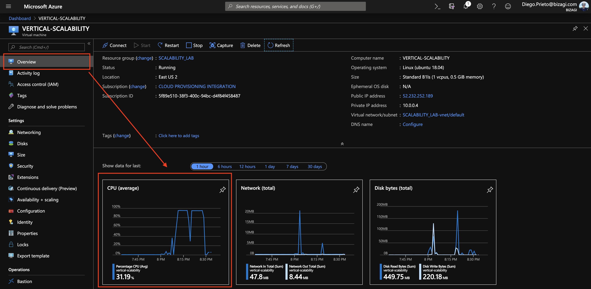

### Escuela Colombiana de Ingeniería
### Arquitecturas de Software - ARSW

## Escalamiento en Azure con Maquinas Virtuales, Sacale Sets y Service Plans

### Dependencias
* Cree una cuenta gratuita dentro de Azure. Para hacerlo puede guiarse de esta [documentación](https://azure.microsoft.com/es-es/free/students/). Al hacerlo usted contará con $100 USD para gastar durante 12 meses.

### Parte 0 - Entendiendo el escenario de calidad

Adjunto a este laboratorio usted podrá encontrar una aplicación totalmente desarrollada que tiene como objetivo calcular el enésimo valor de la secuencia de Fibonnaci.

**Escalabilidad**
Cuando un conjunto de usuarios consulta un enésimo número (superior a 1000000) de la secuencia de Fibonacci de forma concurrente y el sistema se encuentra bajo condiciones normales de operación, todas las peticiones deben ser respondidas y el consumo de CPU del sistema no puede superar el 70%.

### Parte 1 - Escalabilidad vertical

1. Diríjase a el [Portal de Azure](https://portal.azure.com/) y a continuación cree una maquina virtual con las características básicas descritas en la imágen 1 y que corresponden a las siguientes:
    * Resource Group = SCALABILITY_LAB
    * Virtual machine name = VERTICAL-SCALABILITY
    * Image = Ubuntu Server 
    * Size = Standard B1ls
    * Username = scalability_lab
    * SSH publi key = Su llave ssh publica


2. Para conectarse a la VM use el siguiente comando, donde las `x` las debe remplazar por la IP de su propia VM (Revise la sección "Connect" de la virtual machine creada para tener una guía más detallada).

    `ssh scalability_lab@xxx.xxx.xxx.xxx`

3. Instale node, para ello siga la sección *Installing Node.js and npm using NVM* que encontrará en este [enlace](https://linuxize.com/post/how-to-install-node-js-on-ubuntu-18.04/).
4. Para instalar la aplicación adjunta al Laboratorio, suba la carpeta `FibonacciApp` a un repositorio al cual tenga acceso y ejecute estos comandos dentro de la VM:

    `git clone <your_repo>`

    `cd <your_repo>/FibonacciApp`

    `npm install`

5. Para ejecutar la aplicación puede usar el comando `npm FibinacciApp.js`, sin embargo una vez pierda la conexión ssh la aplicación dejará de funcionar. Para evitar ese compartamiento usaremos *forever*. Ejecute los siguientes comando dentro de la VM.

    ` node FibonacciApp.js`

6. Antes de verificar si el endpoint funciona, en Azure vaya a la sección de *Networking* y cree una *Inbound port rule* tal como se muestra en la imágen. Para verificar que la aplicación funciona, use un browser y user el endpoint `http://xxx.xxx.xxx.xxx:3000/fibonacci/6`. La respuesta debe ser `The answer is 8`.


7. La función que calcula en enésimo número de la secuencia de Fibonacci está muy mal construido y consume bastante CPU para obtener la respuesta. Usando la consola del Browser documente los tiempos de respuesta para dicho endpoint usando los siguintes valores:
    * 1000000
    * 1010000
    * 1020000
    * 1030000
    * 1040000
    * 1050000
    * 1060000
    * 1070000
    * 1080000
    * 1090000    

8. Dírijase ahora a Azure y verifique el consumo de CPU para la VM. (Los resultados pueden tardar 5 minutos en aparecer).



9. Ahora usaremos Postman para simular una carga concurrente a nuestro sistema. Siga estos pasos.
    * Instale newman con el comando `npm install newman -g`. Para conocer más de Newman consulte el siguiente [enlace](https://learning.getpostman.com/docs/postman/collection-runs/command-line-integration-with-newman/).
    * Diríjase hasta la ruta `FibonacciApp/postman` en una maquina diferente a la VM.
    * Para el archivo `[ARSW_LOAD-BALANCING_AZURE].postman_environment.json` cambie el valor del parámetro `VM1` para que coincida con la IP de su VM.
    * Ejecute el siguiente comando.

    ```
    newman run ARSW_LOAD-BALANCING_AZURE.postman_collection.json -e [ARSW_LOAD-BALANCING_AZURE].postman_environment.json -n 10 &
    newman run ARSW_LOAD-BALANCING_AZURE.postman_collection.json -e [ARSW_LOAD-BALANCING_AZURE].postman_environment.json -n 10
    ```

10. La cantidad de CPU consumida es bastante grande y un conjunto considerable de peticiones concurrentes pueden hacer fallar nuestro servicio. Para solucionarlo usaremos una estrategia de Escalamiento Vertical. En Azure diríjase a la sección *size* y a continuación seleccione el tamaño `B2ms`.


11. Una vez el cambio se vea reflejado, repita el paso 7, 8 y 9.
12. Evalue el escenario de calidad asociado al requerimiento no funcional de escalabilidad y concluya si usando este modelo de escalabilidad logramos cumplirlo.
13. Vuelva a dejar la VM en el tamaño inicial para evitar cobros adicionales.

**Preguntas**

1. ¿Cuántos y cuáles recursos crea Azure junto con la VM? ***6***
	* ***Virtual Network***
	* ***Network Interface***
	* ***Network Security Group***
	* ***Public IP Address***
	* ***Disk***
	* **SSH Key**

2. ¿Brevemente describa para qué sirve cada recurso?
	* ***Virtual Network***  : Permite a los usuarios crear una red virtual 				  privada.
	
	* ***Network Interface*** : Actúa como un adaptador de red para una máquina virtual, actúa como un adaptador de red para una máquina virtual.
	* ***Network Security Group*** : Permite a los usuarios filtrar el tráfico de red en sus recursos de Azure, actúa como un firewall que permite o bloquea el tráfico de red según una serie de reglas que se establecen por el usuario.
	* ***Public IP Address*** : Es una dirección IP que se puede utilizar para acceder a una máquina virtual o servicio en la nube desde Internet
	* ***Disk*** : Es un archivo VHD (disco duro virtual) que se almacena en un almacenamiento de Azure y que se puede utilizar para almacenar datos, instalar sistemas operativos y aplicaciones, y realizar copias de seguridad y restauraciones en la nube
	* **SSH Key** : Par de claves criptográficas utilizado para autenticar y asegurar la conexión entre un usuario y una máquina virtual en Azure a través del protocolo SSH
3. ¿Al cerrar la conexión ssh con la VM, por qué se cae la aplicación que ejecutamos con el comando `npm FibonacciApp.js`? ¿Por qué debemos crear un *Inbound port rule* antes de acceder al servicio?
	* Está siendo ejecutada en segundo plano y se cierra la sesión SSH que la inició, la aplicación también se detendrá.
	* Necesario para permitir el acceso a la aplicación desde fuera de la máquina virtual
4. Adjunte tabla de tiempos e interprete por qué la función tarda tando tiempo.

La cantidad de recursos de la B1s es inferior a la de la B2s haciendo que a mayores requerimientos de procesamiento de la solicitud, mayores serian sus tiempos a coste de procesamiento.
5. Adjunte imágen del consumo de CPU de la VM e interprete por qué la función consume esa cantidad de CPU.

Probablemente hay varias esperas activas o calculos repetitivos dentro del calculo del numero de fibonacci.
6. Adjunte la imagen del resumen de la ejecución de Postman. Interprete:
    * Tiempos de ejecución de cada petición.
    * Si hubo fallos documentelos y explique.

	El tiempo de ejecución se muestra cerca a los 4 minutos y medio, no presenta errores ademas de bloquear algunas peticiones a raiz del alto consumo de la CPU, posteriormente al re-escalar, se mejoran los tiempos aunque surge algunos errores por aparente alta concurrencia.
7. ¿Cuál es la diferencia entre los tamaños `B2ms` y `B1ls` (no solo busque especificaciones de infraestructura)?
-   B2ms: Tiene 2 vCPUs, 8 GB de RAM, 4 data disk y cuesta $ 77.38 dólares mensuales.
-   B1ls: Tiene 1 vCPUs, 0.5 GB de RAM, 2 data disk y cuesta $ 4.82 dólares mensuales.
8. ¿Aumentar el tamaño de la VM es una buena solución en este escenario?, ¿Qué pasa con la FibonacciApp cuando cambiamos el tamaño de la VM?
	* Aumentar el tamaño de una VM puede proporcionar más recursos de procesamiento, memoria y almacenamiento, lo que puede mejorar el rendimiento de la carga de trabajo. Sin embargo, es importante tener en cuenta que también puede aumentar el costo de la VM.
	* Las solicitudes se procesan más rapido y los calculos del número de fibonacci tambien 
9. ¿Qué pasa con la infraestructura cuando cambia el tamaño de la VM? ¿Qué efectos negativos implica?
	* Se reinicia la VM lo que interrumpe cualquier aplicación o servicio que se encuentre corriendo en la VM
	* Además del aumento de los costos, puede haber problemas de escalado de recursos, como el almacenamiento, la red y los recursos de procesamiento, que deben ajustarse para que coincidan con el nuevo tamaño de la VM.
10. ¿Hubo mejora en el consumo de CPU o en los tiempos de respuesta? Si/No ¿Por qué?
	* Si bien se ve una leve mejora en el tiempo en las primeras solicitudes , no se ve mucha diferencia en las ultimas, haciendo que se concluya como que hay una mejora minima, poco evidente para un usuario final.
11. Aumente la cantidad de ejecuciones paralelas del comando de postman a `4`. ¿El comportamiento del sistema es porcentualmente mejor?
	* Si, menos fallos

### Parte 2 - Escalabilidad horizontal

#### Crear el Balanceador de Carga

Antes de continuar puede eliminar el grupo de recursos anterior para evitar gastos adicionales y realizar la actividad en un grupo de recursos totalmente limpio.

1. El Balanceador de Carga es un recurso fundamental para habilitar la escalabilidad horizontal de nuestro sistema, por eso en este paso cree un balanceador de carga dentro de Azure tal cual como se muestra en la imágen adjunta.
2. A continuación cree un *Backend Pool*, guiese con la siguiente imágen.
3. A continuación cree un *Health Probe*, guiese con la siguiente imágen.
4. A continuación cree un *Load Balancing Rule*, guiese con la siguiente imágen.


5. Cree una *Virtual Network* dentro del grupo de recursos, guiese con la siguiente imágen.


#### Crear las maquinas virtuales (Nodos)

Ahora vamos a crear 3 VMs (VM1, VM2 y VM3) con direcciones IP públicas standar en 3 diferentes zonas de disponibilidad. Después las agregaremos al balanceador de carga.

1. En la configuración básica de la VM guíese por la siguiente imágen. Es importante que se fije en la "Avaiability Zone", donde la VM1 será 1, la VM2 será 2 y la VM3 será 3.
2. En la configuración de networking, verifique que se ha seleccionado la *Virtual Network*  y la *Subnet* creadas anteriormente. Adicionalmente asigne una IP pública y no olvide habilitar la redundancia de zona.
3. Para el Network Security Group seleccione "avanzado" y realice la siguiente configuración. No olvide crear un *Inbound Rule*, en el cual habilite el tráfico por el puerto 3000. Cuando cree la VM2 y la VM3, no necesita volver a crear el *Network Security Group*, sino que puede seleccionar el anteriormente creado.
4. Ahora asignaremos esta VM a nuestro balanceador de carga, para ello siga la configuración de la siguiente imágen.


#### Probar el resultado final de nuestra infraestructura
1. Finalmente debemos instalar la aplicación de Fibonacci en la VM. para ello puede ejecutar el conjunto de los siguientes comandos, cambiando el nombre de la VM por el correcto

```
git clone https://github.com/daprieto1/ARSW_LOAD-BALANCING_AZURE.git

curl -o- https://raw.githubusercontent.com/creationix/nvm/v0.34.0/install.sh | bash
source /home/vm1/.bashrc
nvm install node

cd ARSW_LOAD-BALANCING_AZURE/FibonacciApp
npm install

npm install forever -g
forever start FibonacciApp.js
```

Realice este proceso para las 3 VMs, por ahora lo haremos a mano una por una, sin embargo es importante que usted sepa que existen herramientas para aumatizar este proceso, entre ellas encontramos Azure Resource Manager, OsDisk Images, Terraform con Vagrant y Paker, Puppet, Ansible entre otras.

2. Porsupuesto el endpoint de acceso a nuestro sistema será la IP pública del balanceador de carga, primero verifiquemos que los servicios básicos están funcionando, consuma los siguientes recursos:

```
http://52.155.223.248/
http://52.155.223.248/fibonacci/1
```


3. Realice las pruebas de carga con `newman` que se realizaron en la parte 1 y haga un informe comparativo donde contraste: tiempos de respuesta, cantidad de peticiones respondidas con éxito, costos de las 2 infraestrucruras, es decir, la que desarrollamos con balanceo de carga horizontal y la que se hizo con una maquina virtual escalada.

4. Agregue una 4 maquina virtual y realice las pruebas de newman, pero esta vez no lance 2 peticiones en paralelo, sino que incrementelo a 4. Haga un informe donde presente el comportamiento de la CPU de las 4 VM y explique porque la tasa de éxito de las peticiones aumento con este estilo de escalabilidad.

```
newman run ARSW_LOAD-BALANCING_AZURE.postman_collection.json -e [ARSW_LOAD-BALANCING_AZURE].postman_environment.json -n 10 &
newman run ARSW_LOAD-BALANCING_AZURE.postman_collection.json -e [ARSW_LOAD-BALANCING_AZURE].postman_environment.json -n 10 &
newman run ARSW_LOAD-BALANCING_AZURE.postman_collection.json -e [ARSW_LOAD-BALANCING_AZURE].postman_environment.json -n 10 &
newman run ARSW_LOAD-BALANCING_AZURE.postman_collection.json -e [ARSW_LOAD-BALANCING_AZURE].postman_environment.json -n 10
```

**Preguntas**

* ¿Cuáles son los tipos de balanceadores de carga en Azure y en qué se diferencian?, ¿Qué es SKU, qué tipos hay y en qué se diferencian?, ¿Por qué el balanceador de carga necesita una IP pública?
	* Basic Load Balancer : balanceador de carga regional que distribuye el tráfico entre instancias de máquinas virtuales dentro de una misma región de Azure.
	* Standard Load Balancer : balanceador de carga global que puede distribuir el tráfico entre instancias de máquinas virtuales en diferentes regiones de Azure
	* Application Load Balancer : balanceador de carga de nivel de aplicación que puede enrutar el tráfico basándose en la información de la capa de aplicación, como el URI o las cabeceras HTTP
	* Network Load Balancer : balanceador de carga de nivel de red que distribuye el tráfico basándose en las direcciones IP de origen y destino y los puertos de destino
	* SKU (Stock Keeping Unit) : identificador único utilizado en Azure para describir el conjunto de características de un recurso específico. máquinas virtuales, discos, balanceadores de carga, etc.
	* El balanceador de carga necesita una dirección IP pública porque actúa como un punto de entrada para los clientes externos que intentan acceder a una aplicación o servicio en Azure.
	
* ¿Cuál es el propósito del *Backend Pool*?
	* proporcionar una lista de recursos de backend que se utilizarán para procesar el tráfico entrante que llega a un balanceador de carga en Azure
* ¿Cuál es el propósito del *Health Probe*?
	* determinar si un recurso de backend, como una instancia de máquina virtual, está disponible y en funcionamiento
* ¿Cuál es el propósito de la *Load Balancing Rule*? ¿Qué tipos de sesión persistente existen, por qué esto es importante y cómo puede afectar la escalabilidad del sistema?.
	* El propósito de una Load Balancing Rule es especificar cómo se distribuirá el tráfico entrante a los recursos de backend en un balanceador de carga en Azure
	* Existen dos tipos de sesiones persistentes: basadas en IP y basadas en cookie
	* estas son importantes para garantizar que la información de sesión de una solicitud determinada se enrute al mismo recurso de backend durante toda la duración de la sesión, afecta a la escabilidad del sistema ya que si todos los usuarios se conectan a la misma instancia de máquina virtual en un grupo de disponibilidad, se podría sobrecargar esa instancia y disminuir el rendimiento del sistema en su conjunto.
* ¿Qué es una *Virtual Network*? ¿Qué es una *Subnet*? ¿Para qué sirven los *address space* y *address range*?
	* Una Virtual Network es un servicio en Azure que permite a los usuarios crear una red virtual aislada en la nube que puede conectarse a otros recursos de Azure o a una red local
	* Una Subnet es una parte de una red virtual que se puede usar para aislar los recursos y las máquinas virtuales dentro de la red virtual.
	* El Address Space se refiere al rango de direcciones IP privadas que se pueden usar en una red virtual en Azure.
	* El Address Range se refiere al subconjunto de direcciones IP privadas dentro del espacio de direcciones que se asigna a una subred en particular.
* ¿Qué son las *Availability Zone* y por qué seleccionamos 3 diferentes zonas?. ¿Qué significa que una IP sea *zone-redundant*?
	* Las Availability Zones (zonas de disponibilidad) son una oferta de alta disponibilidad en Azure que proporciona redundancia a nivel de centro de datos. Cada zona de disponibilidad es una ubicación física diferente dentro de una región de Azure, con energía, refrigeración y redes independientes.
	* Al distribuir los recursos de la aplicación en varias zonas de disponibilidad, se puede minimizar el riesgo de interrupción del servicio debido a fallas en una sola zona.
	* Cuando se habla de una IP zone-redundant, significa que la dirección IP está disponible en varias zonas de disponibilidad dentro de una región de Azure.
* ¿Cuál es el propósito del *Network Security Group*?
	* es un componente de seguridad que se puede usar en Azure para controlar el tráfico de red que entra y sale de los recursos de Azure, como máquinas virtuales, subredes y redes virtuales.
* Informe de newman 1 (Punto 2)
* Presente el Diagrama de Despliegue de la solución.
	* 


